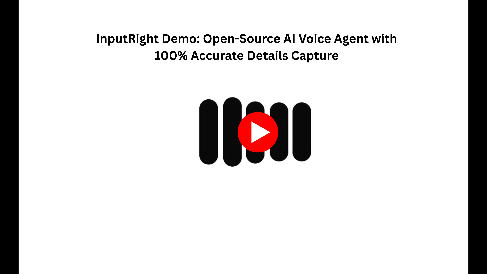

# InputRight

**InputRight is an open-source platform that lets you deploy voice agents that turn conversations into perfectly accurate, verified , structured data.**

This repository contains the code for a complete, voice AI platform that allows you to deploy voice-enabled AI receptionists that can answer questions and reliably capture information from users.

**NOTE:** **InputRight was created by a Human CEO working with an AI CTO Working with an AI software engineer which provided instructions to Gemini CLI.** Although the open source code is tested and working **Please ensure you check the code yourself before using for any production use cases.**

---

---

##  The Open Core Model

This project follows a modern open-core model, providing two distinct editions:

*   **InputRight (Open Source):** The free, self-hostable core engine. Perfect for developers who want to integrate a powerful voice-to-form agent into their own projects.
    *   **[>> Get Started with the Open-Source Kit <<](./apps/open-source/README.md)**

*   **InputRight (Cloud) - *Coming Soon!*** The fully-managed, multi-tenant SaaS platform. The easiest way to deploy a "Digital Receptionist" for your business with zero code and zero hassle.
    *   **Interested in early access? [Join our waitlist!](https://inputright.com/)**

---

## ✨ Key Features

*   **Voice-First Interaction:** Enables natural, hands-free conversation as the primary user interface.
*   **Guaranteed Data Accuracy:** Features a unique, RPC-driven workflow where the user visually verifies all captured information in a form, eliminating errors.
*   **Extensible & Configurable:** The agent's personality, knowledge base, and tools can be easily configured.
*   **Built on a Professional Stack:** Powered by LiveKit for real-time communication and a robust Python/FastAPI and React/Next.js foundation.

---

## ️ Roadmap: The Verified Data Platform

Our core mission is to provide the most reliable way to turn conversations into perfectly accurate, structured data. Every feature on our roadmap is designed to either enhance our unique **Human-in-the-Loop Verification** process or to leverage that guaranteed-accurate data to perform high-value actions for your business.

*   ### **Leveraging Verified Data with Advanced Tools**
    Once data is confirmed by the user, it becomes a trusted asset. We will build tools that use this asset to perform actions that demand 100% accuracy, eliminating costly errors from manual data entry.
    *   **Appointment Booking:** Use the verified name, email, and inquiry to book appointments directly into calendars (Google Calendar, Calendly) without the risk of typos.
    *   **CRM Integration:** Create and update customer records in platforms like HubSpot or Salesforce with perfectly accurate data, every time.
    *   **Custom Workflows:** Enable businesses to trigger any internal process via webhooks, sending verified data to invoicing systems, project management tools, or custom software.

*   ### **Enhancing Verification with Multimodal Input**
    We will expand the workflow to include more than just text, increasing the richness and accuracy of the data you can capture.
    *   **Live Video Analysis:** Allow a user to show the agent a problem (e.g., a leaky pipe) via their webcam. The agent will analyze the video and confirm its understanding verbally ("Okay, I see a leak from the copper joint under the sink. Is that correct?"). Once the user confirms, this assessment will be added to the **final verification form** for the user to visually approve before submission.
    *   **File & Document Uploads:** Enable users to upload a photo or document. The agent will process it, extract the relevant information (like a model number from a photo or dates from a document), and then **present that extracted data back to the user in the verification form** for their final approval.

*   ### **Building Trust with AI Avatars**
    To make the verification process feel more natural and trustworthy, we will integrate with leading real-time avatar providers. This will give your agent a face, enhancing the sense of a professional, human-like interaction and increasing user engagement.

---

##  Getting Started

To get started with the open-source version, please see the detailed instructions in the [`apps/open-source/README.md`](./apps/open-source/README.md) file.

---

## 💬 Community & Support

Join our community on Discord to ask questions, share what you've built, and connect with the team!

*   **[>> Join the InputRight Discord Server <<](https://discord.gg/btqHQek3Pr)**

---

## 🔒 Security and Compliance Disclaimer

The open-source version of InputRight is provided as-is and is **NOT** compliant with regulations such as HIPAA or PCI DSS out of the box. You are solely responsible for ensuring that your implementation, configuration, and hosting environment meet any and all legal and regulatory requirements for your specific use case.

The upcoming **InputRight Cloud** service will offer enterprise-grade security and compliance features for regulated industries.
