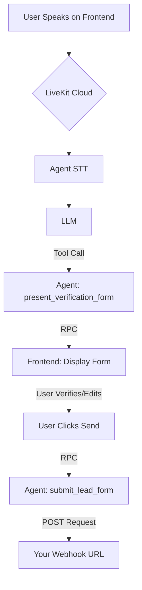

# InputRight (Open Source Kit)

This directory contains the complete, self-hostable version of the InputRight agent. It's a full-stack application designed to be run locally or on your own infrastructure, providing a powerful voice-to-verified-form workflow.

---

##  Quick Start

Get the complete open-source kit running on your local machine in under 5 minutes.

### Prerequisites:

*   Git, Python (3.9+), Node.js (v20+), and pnpm.
*   API keys for [LiveKit](https://cloud.livekit.io/), [Deepgram](https://deepgram.com/), [Groq](https://groq.com/), and [Cartesia](https://cartesia.ai/).

### 1. Clone the Repository:

```bash
git clone https://github.com/jeffo777/input-right.git
cd chat-to-form
```
### 2. Configure the Open-Source Kit:
Navigate to the `apps/open-source` directory. Copy the `.env.example` file in this directory to a new file named `.env`.

Open your new `.env` file and add your API keys and a webhook URL (you can get a free one from [Webhook.site](https://webhook.site/)). This single configuration file is used by all components of the open-source kit (Token Server and Agent).

### 3. Run the Application (in 3 separate terminals):
#### Terminal 1: Start the Token Server
```bash
cd apps/open-source/token-server

# Create and activate a virtual environment
python -m venv venv
# On Windows:
.\venv\Scripts\activate
# On Mac/Linux:
# source venv/bin/activate

# Install exact dependencies from the lock file for a stable build
pip install -r requirements.lock
uvicorn main:app --port 8002
```
#### Terminal 2: Start the Frontend
```bash
cd apps/open-source/frontend

pnpm install
pnpm dev
```
#### Terminal 3: Start the Agent
```bash
cd apps/open-source/agent

# Create and activate a virtual environment
python -m venv venv
# On Windows:
.\venv\Scripts\activate
# On Mac/Linux:
# source venv/bin/activate

# Install dependencies
pip install -r requirements.txt

# Install the local core-agent package
# On Windows:
pip install -e ..\..\..\packages\core-agent
# On Mac/Linux:
# pip install -e ../../../packages/core-agent

# Run the agent
python main.py dev
```
### 4. Start a Conversation:
Open your browser to `http://localhost:3000` (or the port specified by the frontend server).

### Why InputRight?
In a world of unreliable AI and tedious web forms, InputRight provides a new, more human way to capture structured data. It's built on a simple, powerful principle: conversational interaction with guaranteed data accuracy.

Purely voice-based AI is fast, but prone to transcription errors that corrupt critical data. Traditional web forms are accurate, but can be slow, inconvenient, and inaccessible for many users.

InputRight is the bridge between these two worlds. It enables a fast and natural voice conversation to reliably populate any kind of structured form, from simple contact requests to complex applications.

Voice-First Input: The primary interaction is a natural, spoken conversation, eliminating the need for typing.

The Certainty of Sight: The agent's understanding is instantly presented back to the user in a clean, simple form. The user can then verify the data, make corrections via text input, or simply tell the agent what to change, creating a seamless loop of conversational editing.

User-Verified for 100% Accuracy: Because the user sees the form and gives final approval, the submitted data is guaranteed to be exactly what they intended, eliminating costly transcription errors.

Connect to Anything: The open-source agent sends captured data to a configurable webhook, allowing you to easily connect it to any CRM, database, or workflow tool like Zapier or Make.com.

Extensible Platform: The underlying architecture is built on LiveKit and is designed to be extended with powerful multimodal capabilities.
This makes InputRight the perfect tool for any workflow where data accuracy is paramount:
Lead Capture: For contractors, law firms, and any business where a new lead is the lifeblood of the company.
Patient Intake: For healthcare providers who need accurate insurance and medical history information.
Customer Support: For gathering detailed issue reports or processing returns.
Financial Applications: For any process that involves capturing sensitive financial data.

This project was born from 20 years of experience as a contractor, where the pain of losing a customer due to a single digit typo in a phone number was a constant source of anxiety. InputRight is the reliable, trustworthy solution for any business that needs to turn conversations into clean, actionable data.

### ️ How It Works
InputRight uses a three-part architecture to provide a robust, real-time experience.

### Contributing
We welcome contributions from the community! Whether it's reporting a bug, suggesting a feature, or submitting a pull request, your help is greatly appreciated. Please see our main Contributing Guide to get started.

### Acknowledgements
This project would not be possible without the incredible open-source work of others. We proudly build upon:
*   [LiveKit](https://livekit.io/): For providing the powerful, real-time WebRTC infrastructure that powers all communication.
*   [LiveKit Agent Starter - React](https://github.com/livekit/agent-starter-react): For providing the excellent, open-source frontend template that we used as a starting point for our user interface.
